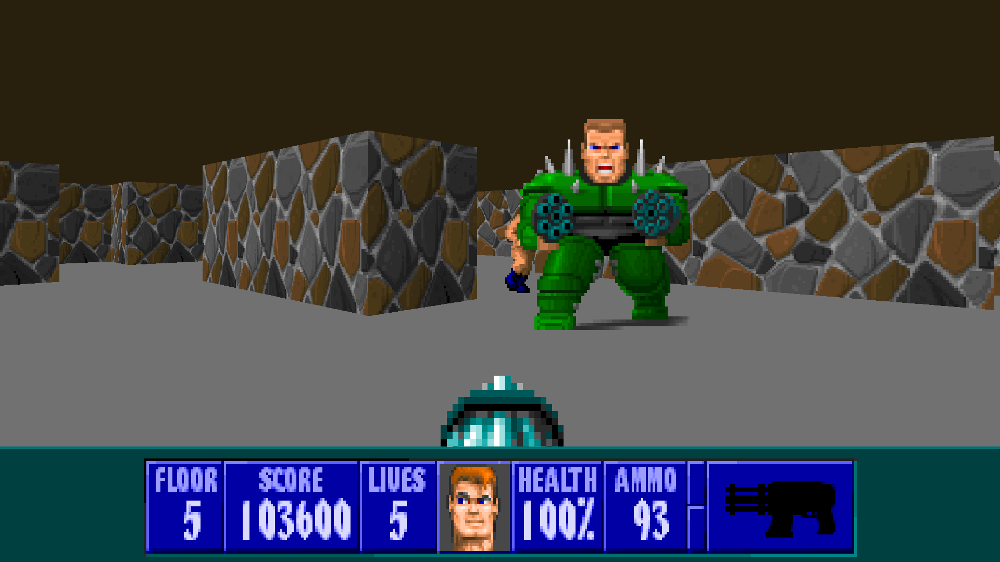

# cub3d
3D graphic engine, made from scratch using just C tools.
The engine loads map files and renders a 3D environment which are playable with mouse and keyboard.
Raycasting is a method to project a 3D illusion based on a 2D map and calculating the distance from player's position to every wall in their field of view.
It is highly efficient as it doesn't need an actual 3D engine to produce 3D images.

